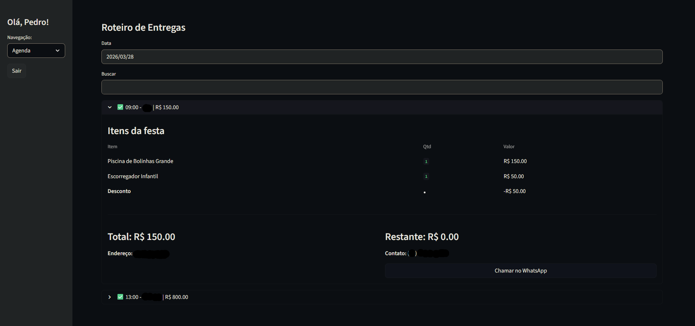
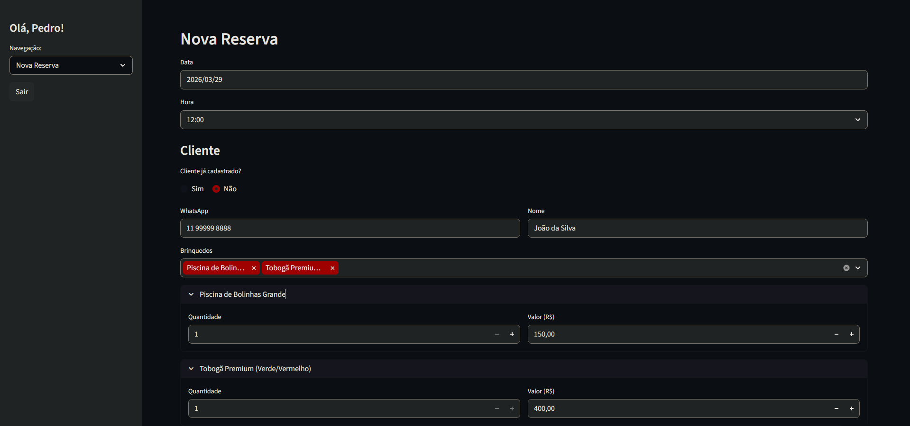
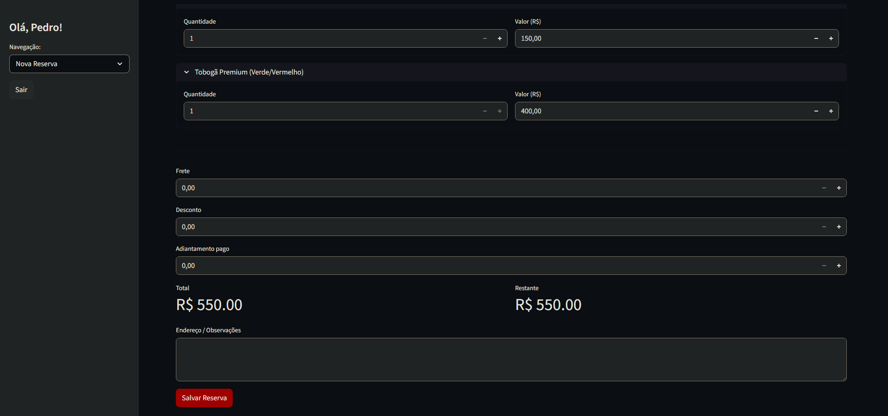
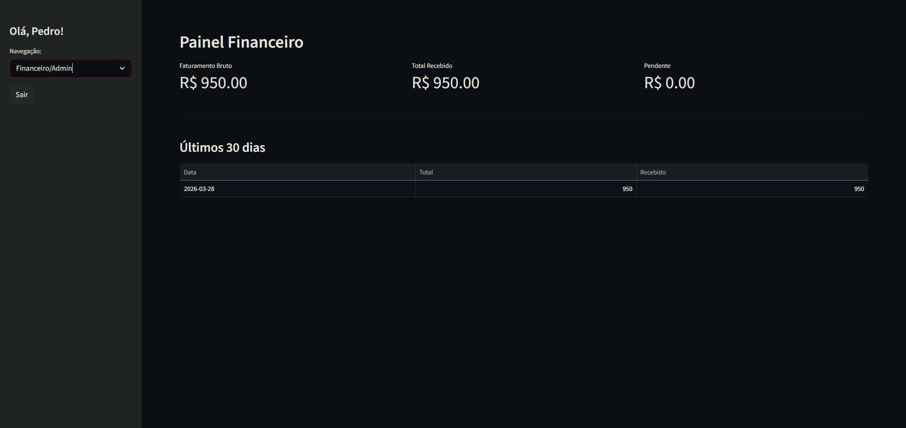

# Sistema de Gestão: Mais Brinquedos

Este projeto é uma solução completa para o gerenciamento de locação de brinquedos. Desenvolvido para transformar o controle manual (planilhas/papel) em um sistema digital ágil, seguro e acessível de qualquer lugar.

---

## Sistema Online

O projeto está hospedado e pronto para uso:
[Acesse aqui](https://maisbrinquedos.streamlit.app/)

---

## O que o sistema faz?

* **Agenda Inteligente:** Controle total das entregas e coletas organizadas por data.
* **CRM de Clientes:** Cadastro rápido com histórico e link direto para conversa no WhatsApp.
* **Inventário Real:** Gestão de disponibilidade de infláveis, camas elásticas e mesas.
* **Segurança:** Painel administrativo restrito para proteção dos dados da empresa.

---

## Arquitetura do Sistema

Diferente de sistemas que rodam apenas no computador, este projeto utiliza tecnologias modernas de nuvem:

* **Frontend/Dashboard:** Python com Streamlit
* **Banco de Dados:** TiDB Cloud (Arquitetura MySQL distribuída)
* **Hospedagem:** Streamlit Community Cloud

---

## Demonstração do Sistema

### Logística e Entregas
Roteiro detalhado para o dia da festa, com controle de itens por cliente, status de pagamento (saldo restante) e atalho direto para contato via WhatsApp.

  

### Fluxo de Reserva
Interface intuitiva para cadastro de novos clientes, seleção de múltiplos itens do inventário e cálculo automático de totais, fretes e descontos.

  
  

### Painel Estratégico
Controle financeiro administrativo com métricas de faturamento bruto, valores efetivamente recebidos e histórico de locações.

  

---
